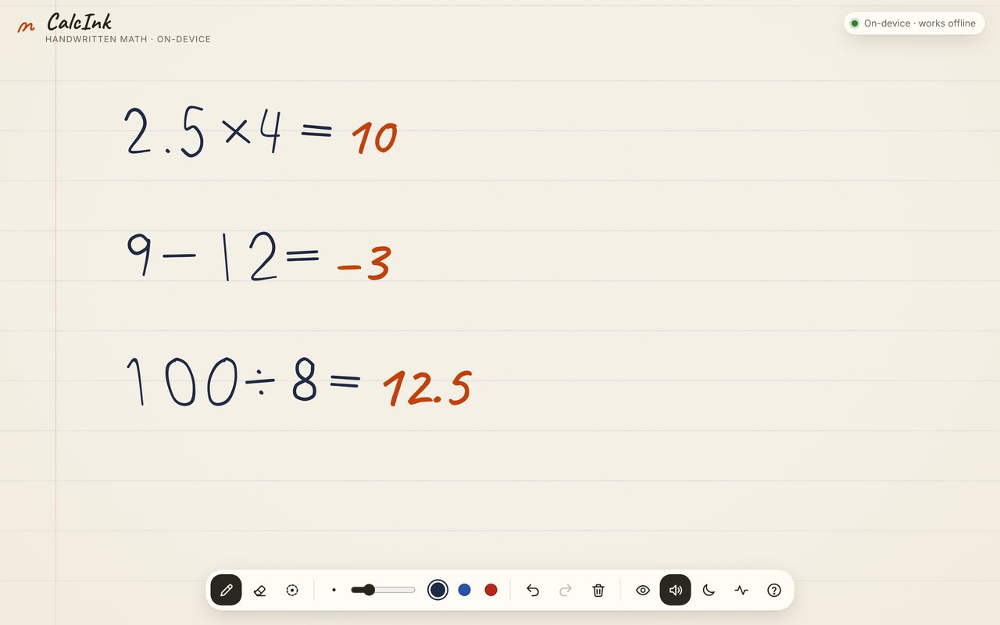
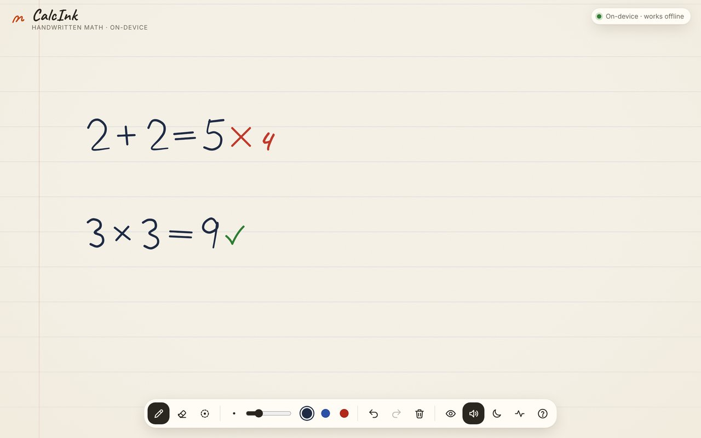
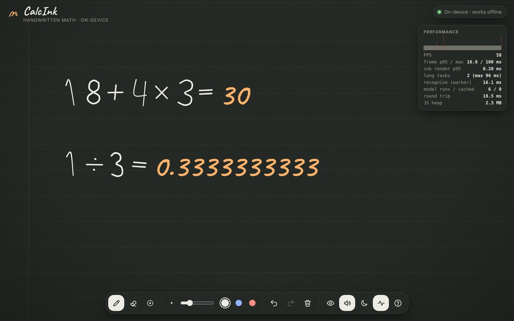
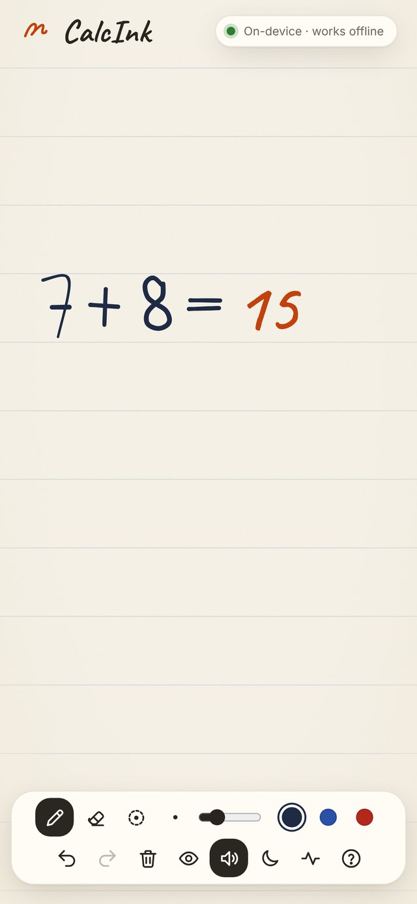

# CalcInk ✍️ = 

**An on-device handwritten math calculator.** Write an arithmetic expression by hand with a mouse, stylus or finger. When you finish it with **=**, CalcInk reads your handwriting with a neural network that runs in your browser and writes the answer next to your equals sign. Erase or rewrite any number and the answer updates straight away.

**Live demo:** https://calcink-iitg-rj.netlify.app

- **100% client-side.** Stroke capture, preprocessing, neural-network inference and evaluation all run in the browser. Nothing is uploaded.
- **Works offline.** After the first visit, a service worker has cached the whole app, including the WASM runtime and the model, so it works in airplane mode.
- **60 FPS ink.** All recognition runs in a Web Worker, so drawing never waits on the model.
- **No `eval()`.** A recursive-descent parser evaluates on exact BigInt fractions (BODMAS, decimals, negatives). Division by zero shows **Undefined**.



| Check your own answers | Dark "slate" paper + live performance HUD | Phone |
|---|---|---|
|  |  |  |

---

## Quick start

Requires **Node.js ≥ 20.19** (Node 22 LTS recommended).

```bash
npm install
npm run dev          # → http://localhost:5280
```

Production build (this also turns on the offline service worker):

```bash
npm run build
npm run preview      # → http://localhost:4173
```

To try offline mode, open the preview URL once, then turn on airplane mode or tick DevTools → Network → **Offline**, and reload.

### Tests and benchmarks

```bash
npm test                         # 105 unit + integration tests (Vitest, runs the real ONNX model in Node)
npx playwright install chromium  # one-time browser download for E2E
npm run test:e2e                 # 15 Playwright E2E tests: real mouse input, offline, FPS, memory
npm run bench                    # recognition accuracy benchmark (STYLE=hard for messy handwriting)
npm run typecheck
```

---

## Using CalcInk

| Action | How |
|---|---|
| Compute | Write e.g. `18 + 4 × 3 =`. The answer (`30`) is written in beside the `=` |
| Edit | Erase or overwrite any symbol and the answer re-evaluates automatically |
| Check your work | Write your own answer after `=` and get ✓, or ✗ plus the correct value |
| Erase | Stroke eraser **E**, pixel eraser **X**, or **scribble back and forth** over ink (scratch-out) |
| Undo / redo | **Ctrl+Z** / **Ctrl+Shift+Z**. Every action is undoable, including Clear |
| See what it read | Hover over an answer for the exact fraction, confidence and latency, or press **I** for per-symbol boxes and confidences |
| Performance | **F** (or `?perf` in the URL) opens a HUD with FPS, frame p95, long tasks and worker timings |

Vocabulary: digits `0–9`, `+`, `−`, `×` (also a raised dot `·`), `÷` (also a slanted `/`), the decimal point `.`, and `=`.

---

## Model attribution

| | |
|---|---|
| **Model** | **MNIST-12**, a handwritten-digit CNN from the ONNX Model Zoo |
| **Source** | <https://github.com/onnx/models/tree/main/validated/vision/classification/mnist> (file `model/mnist-12.onnx`) |
| **License** | MIT (see [`docs/MODEL_CARD_mnist.md`](docs/MODEL_CARD_mnist.md); SPDX header in the upstream README) |
| **Origin** | Trained in Microsoft CNTK following the *CNTK 103D* tutorial, then exported to ONNX (opset 12) |
| **Architecture** | `1×28×28` → Conv 5×5 ×8 + ReLU → MaxPool 2×2 → Conv 5×5 ×16 + ReLU → MaxPool 3×3 → FC 256→10 (≈6 k parameters) |
| **Size / accuracy** | 26 KB · top-1 error 1.1% on MNIST (we measured **99.4%** on 3,000 MNIST samples with the published preprocessing) |
| **I/O** | input `Input3` float32 `[1,1,28,28]`, white ink on black in `[0,1]` · output `Plus214_Output_0` logits `[1,10]` |
| **Runtime** | [ONNX Runtime Web](https://github.com/microsoft/onnxruntime) 1.30 (MIT), WASM backend, inside a Web Worker |

The model is bundled as-is: it was not trained or fine-tuned. Digits come from the model. The operator symbols (`+ − × ÷ = .`) are made of straight bars and dots, so a deterministic stroke-geometry analyser classifies them using the pen trajectory, which the model never sees. [`docs/ARCHITECTURE.md`](docs/ARCHITECTURE.md) explains why, and lists the alternatives we evaluated.

Other third-party components: [perfect-freehand](https://github.com/steveruizok/perfect-freehand) (MIT, ink outlines), [Inter](https://rsms.me/inter/) and [Caveat](https://github.com/googlefonts/caveat) fonts via Fontsource (SIL OFL 1.1), and [vite-plugin-pwa](https://github.com/vite-pwa/vite-plugin-pwa) / Workbox (MIT). The benchmark fixture contains 2,500 skeletonised MNIST digits (MNIST © LeCun, Cortes and Burges, CC BY-SA 3.0, taken from the MIT-licensed `mnist` npm package).

---

## How it works (short version)

```
pointer events ──► InkSurface (UI thread, 60 FPS) ──► StrokeStore ──► deltas ──► Web Worker
                                                                                   │
           AnswerLayer ◄── results (rev-tagged) ◄── evaluate ◄── classify ◄── segment
           (inline answer)                         (BigInt      (geometry │ MNIST-12
                                                    rationals)    for ops │ via ORT WASM)
```

1. **Capture.** Coalesced pointer events (full 120–240 Hz pen rate) are stored as immutable vector strokes in CSS-pixel world space. The canvas backing store is sized to `devicePixelRatio` so ink stays crisp.
2. **Segment** (in the worker). Strokes are clustered into lines, then symbols (union-find on containment and touch tests; ÷ dots bind to their bar).
3. **Bridge to tensors.** Each digit's strokes are rasterised directly from vectors into an MNIST-style `28×28` tensor: fit to a 20 px box, anti-aliased analytic pen, centre-of-mass recentring, moment-based deskew.
4. **Classify.** Geometry decides operators. MNIST-12 decides digits. Results are cached per immutable stroke set, so an edit only re-runs the symbols that changed.
5. **Evaluate.** Tokenizer → recursive-descent parser → exact rational arithmetic. The worker never throws; errors come back as typed results.
6. **Project.** The answer is drawn on the canvas next to `=`, with a write-in animation, a confidence underline, and ✓/✗ in check mode.

Full design notes, model-selection rationale, measurements and trade-offs: **[docs/ARCHITECTURE.md](docs/ARCHITECTURE.md)**.

---

## Verified results

| What | Result | How it was measured |
|---|---|---|
| Unit + integration tests | **105 passing** | `npm test` |
| End-to-end tests | **15 passing** | `npm run test:e2e` (Chromium, real mouse input, DPR 2) |
| Glyph accuracy (synthetic writers) | **100%** normal · **99.8%** messy | `npm run bench`, 150 samples × 16 glyphs |
| Whole-expression exact match | **100%** normal · **96.7%** messy | 300 random expressions such as `795.1÷8.0÷897÷2=` |
| Real human digit shapes | **96.3%** | 2,500 real MNIST digits skeletonised to pen strokes → our rasteriser → model |
| Frame rate while recognising | **~60 FPS**, frame p95 16.8 ms, **0 long tasks** | E2E perf test (writing continuously while the worker recognises) |
| Ink render cost per frame | **p95 ≈ 0.2 ms** | `InkSurface` frame timer |
| Recognition latency | **~2 ms** compute, ~8–20 ms worker round trip | Perf HUD / benchmark |
| Offline | Full pipeline works with the network disabled, **0 external requests** | `tests/e2e/offline.spec.ts` |
| Memory | UI heap flat at ~1.9 MB over 10 write/recognise/clear cycles | `tests/e2e/memory.spec.ts` (forced GC) |

Raw numbers are in [`docs/benchmark.json`](docs/benchmark.json) and [`docs/benchmark-hard.json`](docs/benchmark-hard.json).

---

## Deployment

The build is a static folder (`dist/`) with relative URLs, so it runs from any host or sub-path.

- **GitHub Pages:** push to `main`. [`.github/workflows/deploy.yml`](.github/workflows/deploy.yml) builds and publishes the site (enable *Settings → Pages → Source: GitHub Actions* once).
- **Netlify / Vercel / Cloudflare Pages:** build command `npm run build`, output directory `dist`.

Single-threaded WASM is used on purpose, so no COOP/COEP headers are needed on any host.

---

## Project structure

```
src/
  main.ts                    boot: fonts, App, service worker
  app/                       App wiring, toolbar, feedback (audio/haptics), hover card, perf HUD, storage
  canvas/                    InkSurface (input + render loop), AnswerLayer (projection), coords, strokePath
  ink/                       immutable Stroke model, StrokeStore, History (undo/redo), erasers, scratch gesture
  recognition/               worker, client, segmentation, operator geometry, rasteriser, engine, ORT adapter
  math/                      rational arithmetic, tokenizer, parser, evaluator, formatter, equation analysis
public/models/mnist-12.onnx  the pre-trained model (bundled, cached offline)
tests/unit/                  Vitest suites (math, ink, coords, recognition with the real model)
tests/e2e/                   Playwright suites (features, offline, memory, FPS)
tests/fixtures/              synthetic handwriting generator, real-MNIST skeleton fixture
scripts/                     recognition benchmark
docs/                        ARCHITECTURE.md, model card, benchmark results, screenshots
```

## Team workflow

Work is split into feature branches (`feat/math-engine`, `feat/ink-model`, `feat/recognition`, `feat/canvas`, `feat/app-shell`, `test/e2e`, `docs/*`), each merged into `main` with a `--no-ff` merge commit that corresponds to a pull request. Commit messages follow [Conventional Commits](https://www.conventionalcommits.org/). See [CONTRIBUTING.md](CONTRIBUTING.md).

## Known limitations

- The vocabulary is fixed by the brief (digits, `+ − × ÷ . =`). Parentheses are supported by the parser but not yet recognised from ink.
- MNIST-12 is a digit model trained on centred, isolated digits. Very cramped writing where digits touch can merge two symbols; the insight view (**I**) shows exactly how the page was segmented.
- Extremely slanted "1"s written with a long entry flag can read as "7". A stroke-order tie-breaker handles the common case, and low-confidence answers get a dotted underline.

## License

MIT, see [LICENSE](LICENSE). Third-party licenses are listed under *Model attribution* above.
