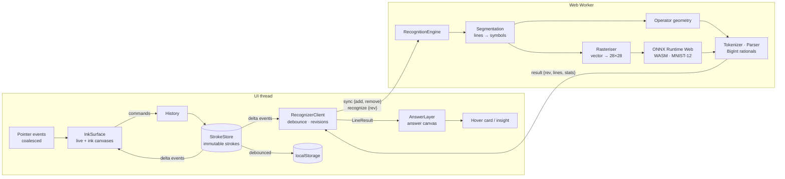
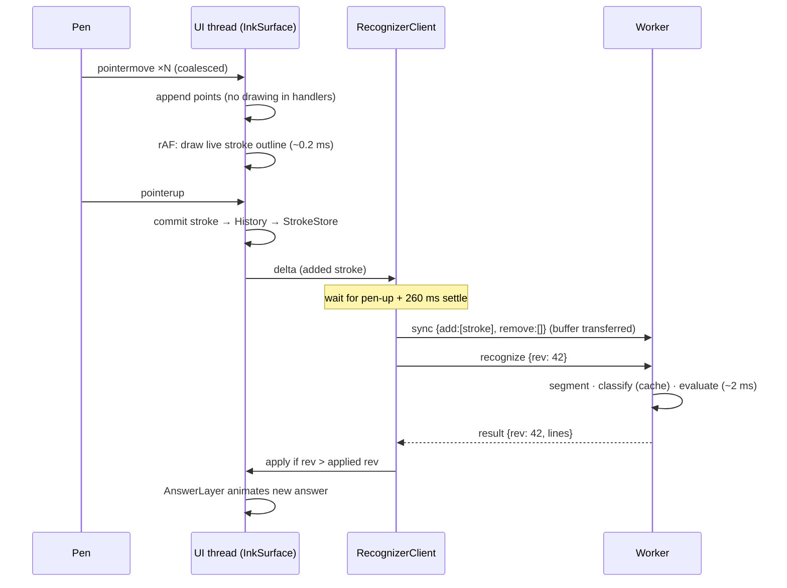

# CalcInk — Architecture & Design

This document explains how CalcInk turns raw pointer coordinates into an evaluated answer drawn on the page, and why it is built this way. Sections:

1. [Requirements → design → evidence](#1-requirements--design--evidence)
2. [System overview](#2-system-overview)
3. [Threading model and the 60 FPS budget](#3-threading-model-and-the-60-fps-budget)
4. [Ink data model and coordinate spaces](#4-ink-data-model-and-coordinate-spaces)
5. [Recognition pipeline: from strokes to tensors](#5-recognition-pipeline-from-strokes-to-tensors)
6. [Model selection](#6-model-selection)
7. [Evaluation engine](#7-evaluation-engine)
8. [Reactive editing and answer projection](#8-reactive-editing-and-answer-projection)
9. [Offline operation](#9-offline-operation)
10. [Fault tolerance](#10-fault-tolerance)
11. [Memory management](#11-memory-management)
12. [Testing and measurement](#12-testing-and-measurement)
13. [Trade-offs and future work](#13-trade-offs-and-future-work)

---

## 1. Requirements → design → evidence

| Requirement (brief) | Design decision | Where it's verified |
|---|---|---|
| Fluid ink for mouse, stylus and touch, with smooth curves | Pointer Events + `getCoalescedEvents()`, perfect-freehand outlines traced as quadratic Béziers, pressure from the pen or simulated from velocity | E2E: every test draws with real mouse input; touch verified via CDP touch events |
| Undo/redo, stroke and pixel eraser, clear, width | One reversible `{added, removed}` command type for every edit; vector pixel eraser that splits strokes | `tests/unit/ink.test.ts`, E2E undo/clear/eraser tests |
| High-DPI scaling | Ink stored in CSS px; backing store = CSS size × `devicePixelRatio`, re-sized on DPR change | `tests/unit/coords.test.ts`, E2E checks `canvas.width == 2 × clientWidth` at DPR 2 |
| Digits, `+ − × ÷ . =` | MNIST-12 CNN for digits + deterministic stroke geometry for operators | `tests/unit/recognition.test.ts`, `npm run bench` |
| Existing open-source pre-trained model, client-side | ONNX Model Zoo MNIST-12 (MIT) via ONNX Runtime Web (WASM) | Model card, `src/recognition/recognizer.worker.ts` |
| BODMAS, multi-digit, decimals, negatives | Recursive-descent parser over exact BigInt rationals | 48 math unit tests |
| Answer drawn next to `=`, live re-evaluation | `AnswerLayer` anchored to the `=` symbol's box; recognition reruns on every edit | E2E: erase "3" → write "9" → answer changes 8 → 14 |
| 100% on-device, offline | Everything bundled, Workbox precache of the app, WASM and model | E2E offline test asserts **0 external requests** |
| 60 FPS during inference | All recognition in a Web Worker; on-demand rAF rendering; no backdrop blur over the canvas | E2E perf test: 0 long tasks, frame p95 16.8 ms |
| No `eval()`; graceful errors | Tokenizer + parser; typed results (`value` / `undefined` / `error`); the worker never throws | Malformed-input tests; `Undefined` E2E |
| No memory leaks | Immutable strokes + `WeakMap` caches, bounded history and LRU, explicit tensor disposal | E2E memory test with forced GC |

---

## 2. System overview



Module boundaries follow the data flow. `ink/` and `math/` have no DOM dependencies. `recognition/` (apart from the client) runs under Node too, which is why the unit tests can drive the real model end to end.

---

## 3. Threading model and the 60 FPS budget



What keeps the main thread inside its 16.7 ms frame budget:

- **Input handlers never draw.** They append points and request a frame. One `requestAnimationFrame` callback renders whatever changed, and only when something changed, so an idle page costs nothing.
- **Three canvases.** `ink` holds committed strokes and is drawn incrementally (only the new stroke is filled), with full redraws only after removals or resizes. `answer` holds the projections. `live` holds the stroke in progress plus the eraser cursor, and uses a `desynchronized` context for lower pen latency where supported.
- **Cached geometry.** A committed stroke's `Path2D` is built once and held in a `WeakMap`, so a full redraw is only a series of `fill(path)` calls.
- **Measured and removed a compositor cost.** A `backdrop-filter` blur on the floating toolbar forced the compositor to re-blur the live canvas every frame, which dropped drawing to about 45 FPS at DPR 2 in our measurements. It was replaced with a near-opaque paper tone (see the note in `main.css`).
- **No heavy work on the UI thread.** Segmentation, rasterisation, inference and evaluation all run in the worker. Only small deltas cross the thread boundary, and stroke buffers are *transferred* rather than copied.
- **Recognition waits for the pen to lift**, plus a 260 ms settle, so the model never wastes work on half-written glyphs and multi-stroke symbols like `+` or `=` are complete.

Measured in E2E (Chromium, DPR 2, writing continuously while the worker recognises): **~60 FPS, p95 frame interval 16.8 ms, 0 long tasks (>50 ms), ink render p95 ≈ 0.2 ms.**

---

## 4. Ink data model and coordinate spaces

```ts
interface Stroke {
  id: string; seq: number;        // identity + z-order
  points: Float32Array;           // [x, y, pressure, x, y, pressure, …] in world px
  width: number; color: string;   // colour is a palette *key*, resolved per theme
  pressure: boolean;              // real stylus pressure vs simulated
  bbox: BBox;                     // precomputed
}
```

Strokes are **frozen and never mutated**. Every edit replaces strokes:

| Edit | `added` | `removed` |
|---|---|---|
| Draw | new stroke | – |
| Stroke eraser gesture | – | every stroke touched |
| Pixel eraser gesture | surviving fragments | originals that were cut |
| Scratch-out | – | strokes under the scribble |
| Clear | – | all strokes |

Undo applies the inverse (`add removed, remove added`), so it is exact by construction. Immutability also turns the set of stroke ids into a perfect cache key for render paths (`WeakMap<Stroke, Path2D>`) and for recognition results (sorted id list → classification).

**Coordinate spaces** (`src/canvas/coords.ts`, unit-tested):

| Space | Units | Conversion |
|---|---|---|
| client | viewport CSS px (`PointerEvent.clientX/Y`) | `world = client − canvasRect.topLeft` |
| world | canvas CSS px, where all ink is stored | `device = world × scale` |
| device | backing-store pixels | `scale = min(dpr, edge/area limits)` |
| model | the 28×28 tensor grid | see §5.3 |

Because ink lives in world space, a DPR change (browser zoom, moving to a Retina screen, detected with a `resolution` media query) only resizes the backing store and redraws, so strokes stay crisp at any density. Backing-store size is clamped to 8192 px per edge and 16.7 MP in total, staying under the canvas limits iOS Safari enforces.

**Pixel eraser on vector ink.** The eraser is a disc. Touched strokes are first densified so a long sparse segment can be cut in the middle. Points inside `radius + width/2` are dropped and the surviving runs become new strokes. A whole drag gesture collapses into one undoable command. Fragments the same gesture creates and then erases again are tracked, so they never leak into history.

**Scratch-out.** A finished stroke counts as a scribble if it has at least 5 direction reversals (hysteresis threshold at 25% of its extent) along x or y, and a path length at least 3.5× its size. Digits like 3 and 8 stay at 4 reversals or fewer. The scribble deletes only strokes that it touches and that have 60% or more of their points inside its area. Otherwise it is kept as ordinary ink.

---

## 5. Recognition pipeline: from strokes to tensors

### 5.1 Line segmentation

Strokes are union-found into lines. Two strokes join the same line when

- *vertically* their centres are within 0.6 × the larger stroke's size, or they overlap by 50% of the shorter height, and
- *horizontally* the gap between them is at most 2.2 × that size.

"Size" is `max(height, 0.5·width, 8px)`, so flat strokes (`−`, `=`) still count. Chaining through neighbours keeps long equations together, while two equations written side by side far apart stay separate.

Per line we compute a **writing band**: the median top and bottom of full-height strokes and a reference height `H`. Every later threshold is relative to `H`, which makes the pipeline scale-invariant.

### 5.2 Symbol segmentation

Strokes join the same symbol when:

1. one stroke's horizontal centre lies inside the other's x-extent (the two bars of `=`, the cross of `+`, the two strokes of `4` or `5`), **or**
2. a flat stroke physically touches another one (centre lines within 6% of `H`), for example the cap of a slanted two-stroke `5`, **or**
3. a dot-sized mark sits inside another symbol's body (a short `7` crossbar).

Dots (`max(w,h) ≤ 0.22 H`) are kept apart from neighbouring digits so they stay decimal points. The exception is a dot directly above or below a horizontal bar, which binds to it as `÷`.

### 5.3 Operator geometry (no network needed)

Stroke features: straightness (chord/length and maximum deviation from the chord), undirected orientation in [0°, 180°), crossing parameters between strokes, and size relative to `H`.

| Glyph | Rule |
|---|---|
| `.` | single dot-sized stroke near the baseline |
| `×` (·) | single dot in the upper or middle band (a raised multiplication dot) |
| `−` | one straight stroke within 25° of horizontal, wide (≥ 0.25 H) and flat |
| `÷` (/) | one straight rising diagonal at 25–62°, tall (≥ 0.5 H) |
| `=` | two straight horizontal bars that don't cross, vertically separated, similar widths |
| `+` / `×` | two straight strokes that cross *in their middle portions* and are at least 50° apart. The winner is whichever ideal arrangement ({0°, 90°} or {45°, 135°}) is closer in total angular distance, which stays robust under slant and rotation |
| `÷` | one bar plus two dots, one above and one below it |

Requiring that the strokes cross *in their middle* (12–88% along both) is what keeps a two-stroke `7`, whose strokes meet at a corner, from being read as `+`.

**Why geometry rather than a second network?** These glyphs are defined by stroke count, orientation and arrangement. A rasteriser throws exactly that information away, while the pen trajectory keeps it. The rules are deterministic, cost microseconds, need no training data, and in our benchmark they reach 100% on normal writing and 99.8% on messy writing.

### 5.4 Vector → tensor bridge (the rasteriser)

`src/recognition/rasterize.ts` reproduces MNIST's normalisation **analytically from stroke coordinates**, instead of screenshotting the canvas:

1. **Deskew.** Measure the slant from second-order moments of the ink (`μ11/μ02`, the classic MNIST statistic, weighted by segment length) and remove 50% of it with an exact shear of the vector points.
2. **Fit.** Scale the symbol's bounding box, preserving aspect ratio, into the 20×20 inner box (minus the pen radius) and centre it in the 28×28 frame.
3. **Render.** For every segment, visit only the pixels near it and set `intensity = max(intensity, f(distance to segment))`, with a solid core of radius 1.0 px and a 1.0 px linear anti-aliased falloff. A single tap renders as a disc.
4. **Centre of mass.** Compute the intensity centroid and **re-render** shifted so it lands exactly at (14, 14), as MNIST does.
5. Output a `Float32Array(784)` in [0, 1] with white ink on black, laid out as `[1,1,28,28]`.

This makes the model input independent of screen DPR, browser zoom, the user's pen width, the paper texture and the theme colours. The parameters (pen radius, softness, deskew strength) were tuned on two benchmark sets: synthetic writers, and 2,500 real MNIST digits skeletonised back into centre lines (§12).

### 5.5 Inference and caching

The worker loads `mnist-12.onnx` with `onnxruntime-web/wasm`, single-threaded, `graphOptimizationLevel: 'all'`. It runs one warm-up inference, then reports `ready` with load timings. The model has a fixed batch size of 1, so symbols run sequentially, about 0.1–0.3 ms each. Input and output tensors are `dispose()`d after every run.

Results are cached in an LRU (4,000 entries) keyed by the sorted stroke-id set of each symbol. After an edit, only the changed symbols reach the network. The E2E and unit tests assert `modelRuns = 0` on an unchanged page.

**1-vs-7 tie-breaker** (`refine.ts`). When the model's top candidates are 1 and 7, the pen trajectory decides: a 7 *starts* with a near-horizontal stroke travelling right, while a flagged 1 starts with an upward tick. The corrected answer gets a moderate confidence, so the UI still flags it.

### 5.6 Confidence

Each symbol carries a confidence: softmax probability for model digits, a rule-specific value for geometry. A line's confidence is the minimum over its symbols. Answers with confidence below 0.85 get a dotted underline (amber, or red below 0.55). The hover card and the insight view show per-symbol values.

---

## 6. Model selection

The brief requires an existing open-source pre-trained model running fully in the browser at 60 FPS. We compared these candidates:

| Candidate | Size | Browser latency (est.) | Vocabulary | License / availability | Verdict |
|---|---|---|---|---|---|
| **ONNX Model Zoo MNIST-12** | **26 KB**, ≈6 k params | **≈0.2 ms / symbol** (WASM) | digits | MIT, official ONNX, validated | ✅ **chosen** for digits |
| MNIST-12-int8 (same zoo) | 11 KB | similar | digits | MIT | ❌ no meaningful gain at 26 KB; quantisation only adds accuracy risk |
| TrOCR (small / base, Hugging Face) | 62 M / 334 M params, 250 MB–1.3 GB | 100s of ms to seconds per line on CPU WASM | general text | MIT | ❌ far too large for an offline PWA; autoregressive decoding blows the latency budget |
| CROHME HMER models (BTTR, CoMER, DWAP) | 6–10 M params, encoder–decoder + beam search | 100–500 ms per expression | full LaTeX math | research code, mostly PyTorch checkpoints without ONNX export | ❌ heavy, export risk, overkill for a 16-symbol vocabulary |
| Tesseract.js | ~10–20 MB of language data | 100s of ms | printed text | Apache-2.0 | ❌ built for printed text; poor on handwriting |
| Kaggle / HASYv2 symbol CNNs | ~1–5 MB | fast | digits + symbols | unclear licences, no maintained ONNX weights | ❌ provenance and licence risk |
| Cloud OCR (Mathpix, Google Vision, GPT vision) | – | network bound | full math | forbidden by the brief | ❌ |

**Why MNIST-12 plus geometry wins.** It is the smallest and fastest option by orders of magnitude, so it adds nothing noticeable to the frame budget. It has a validated ONNX export and a clean MIT licence. It is accurate on exactly the part of the vocabulary that needs learning, the ten digit shapes. The other six glyphs are structurally trivial and better served by deterministic analysis of the pen trajectory, which no pixel model sees. The hybrid is also explainable, as the insight view shows: every symbol is labelled with its source (model, or ◇ for geometry).

**Runtime choice.** ONNX Runtime Web loads the original `.onnx` file without conversion, which keeps the provenance auditable. Its WASM backend runs in a worker with no GPU dependency. We use the single-threaded build so the app needs no cross-origin isolation headers and runs on any static host. TensorFlow.js would have required converting the model. WebGPU brings no benefit for a 6 k-parameter network and is not universally available.

---

## 7. Evaluation engine

`src/math/` is a small, deterministic interpreter:

```
expression := term (('+' | '−') term)*
term       := unary (('×' | '÷') unary)*
unary      := ('+' | '−') unary | primary
primary    := NUMBER | '(' expression ')'
```

- **Exact arithmetic.** Numbers are parsed into BigInt fractions (`12.5` → `25/2`), and `+ − × ÷` are exact, so `0.1 + 0.2 = 0.3` and division by zero is detected exactly, never `Infinity` or `NaN`.
- **Formatting.** Integers print exactly. Other results get up to 10 decimal places within 12 significant digits, rounded half away from zero; very large or tiny values use scientific notation (`1.219326311×10²¹`). The answer is marked inexact when rounded, and the hover card shows the exact fraction (`1/3`).
- **Safety.** No `eval`, `Function` or dynamic code. Recursion depth is capped at 256, operand size at 4,000 digits, and token count at 1,000. `evaluateExpression()` *never throws*: it returns `{kind:'value'}`, `{kind:'undefined'}` (division by zero) or `{kind:'error', code, index}`.
- **Equation analysis.** `18+4×3=` → compute. `2+2=5` → check (✓/✗ plus the correct value). A line without `=` gets no projection. More than one `=` → `?`.

---

## 8. Reactive editing and answer projection

Any change to the page (draw, either eraser, scratch-out, undo, redo, clear) is just a `StrokeStore` delta. The client accumulates deltas, cancelling add-then-remove pairs, and after the pen lifts and settles it sends them with a new revision number. The worker re-segments the whole page, which is cheap, while classification hits the cache for every untouched symbol. A result is applied only if its revision is newer than the last one applied, so a slow result can never overwrite a newer one.

**Placement.** The answer is anchored to the right edge of the `=` symbol's box (or of the user's written answer in check mode) plus 0.3 H, on the line's baseline. Font size is 1.35 H in the Caveat handwriting face, so the answer looks the same size as the user's own writing.

**Identity and animation.** Each line has a stable key derived from its `=` strokes. When the answer for a key changes, the old value fades out while the new one is "written in" with a left-to-right reveal, and a soft synthesised chime plays (WebAudio, no audio files) with a haptic tick on supported devices.

---

## 9. Offline operation

- Everything is self-hosted: the model, the ORT WASM binary, fonts (Fontsource, Latin subset) and icons. The app makes no runtime requests to third-party hosts.
- `vite-plugin-pwa` generates a Workbox service worker that **precaches all 20 assets (≈14 MB, of which ~3.7 MB gzipped is the WASM runtime)**. Navigation falls back to `index.html`.
- The UI is interactive before the model is ready. The status pill reports *Loading → On-device model ready → works offline*, and shows *Offline · running on-device* when `navigator.onLine` is false.
- Verified by `tests/e2e/offline.spec.ts`: visit, cut the network, reload, write `9×8−2=`, get `70`, and confirm that no request left `localhost`.

---

## 10. Fault tolerance

| Situation | Behaviour |
|---|---|
| Malformed expression (`3+×4`, `1..2`, `(`) | `?` badge next to `=`, with the hover card explaining the error; nothing throws |
| Division by zero | **Undefined** in red |
| Model or WASM fails to load | Worker falls back to "unknown" digit scores; operators still work; the status pill says so |
| Worker exception during a pass | Caught; an `error` message is logged and the next edit retries |
| `localStorage` unavailable (private mode, quota) | Every access is wrapped; the app works without persistence |
| Huge canvases or odd `devicePixelRatio` | DPR sanitised to (0, 4], backing store clamped to browser limits |
| Multi-touch or palm on the screen | Only one pointer inks at a time; touch is ignored for 1.5 s after any pen activity |
| AudioContext blocked | Created lazily on the first pointer gesture; failures are ignored silently |

---

## 11. Memory management

- Strokes are immutable, and render caches are `WeakMap`s keyed by the stroke, so they are freed with it.
- History is bounded (300 commands), and starting a new edit discards the redo branch.
- The recognition cache is an LRU of 4,000 entries. ORT tensors are disposed after every run, and the worker keeps a single session for its lifetime.
- No per-frame allocations beyond the live stroke's outline, and no continuous rAF loop while the page is idle.
- Verified by `tests/e2e/memory.spec.ts`: 10 rounds of writing two equations, recognising them and clearing, with forced GC. The UI heap stayed between 1.90 and 1.98 MB.

---

## 12. Testing and measurement

| Layer | Tool | What |
|---|---|---|
| Math | Vitest (48 tests) | precedence, associativity, unary minus, exact decimals, formatting, Undefined, malformed input, nesting and length guards |
| Ink | Vitest | store deltas, undo/redo/clear, history cap, eraser hit-testing, pixel cut, gesture-level undo, scratch detection |
| Coordinates | Vitest | client → world → device conversion, fractional-DPR round trips, backing-store clamping |
| Recognition | Vitest + **real ONNX model in Node** | segmentation, operator rules (25 random writers per glyph), rasteriser invariances, end-to-end expressions, reactive edit, cache reuse, multi-line pages |
| Product | Playwright (15 tests) | real mouse drawing at DPR 2, all features, persistence, offline, FPS and long tasks, memory |
| Accuracy | `npm run bench` | synthetic writers (normal and hard) plus 2,500 real MNIST digits skeletonised into pen strokes |

**Benchmark results** (`docs/benchmark*.json`):

| Set | Result |
|---|---|
| Isolated glyphs, normal writers (16 glyphs × 150) | 100% |
| Isolated glyphs, hard writers (±0.35 slant, ±10° rotation, 6% jitter) | 99.8% |
| Random full expressions, normal | 100% (300/300) |
| Random full expressions, hard | 96.7% (290/300) |
| Real MNIST handwriting via the stroke → rasteriser path | 96.3% (n = 2,500) |
| Pipeline latency per expression (Node, WASM) | ≈1.5 ms |

The real-MNIST figure is a deliberately pessimistic proxy. Skeletonising a scanned digit throws away stroke order and thickness, yet it still tests the rasteriser against genuine human letterforms.

---

## 13. Trade-offs and future work

- **Single-threaded WASM** gives up multi-threaded speed-ups (irrelevant for a 6 k-parameter network) in exchange for zero hosting requirements.
- **The geometry analyser** depends on the stroke-based vocabulary. Extending it to letters or variables (`x = 10`) would need a symbol model, for example a small HASY-trained CNN with a clean licence, running beside MNIST-12 in the same worker.
- **Parentheses and exponents** are already supported by the parser and could be recognised geometrically (tall curved single strokes) as a next step.
- **Pan and zoom** would only need a world → device transform in `coords.ts`, since ink already lives in resolution-independent world space.
